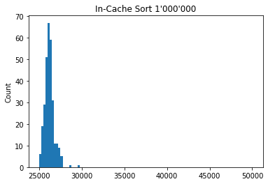
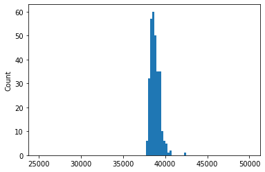
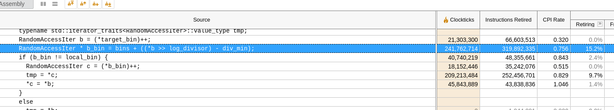

I have written `boost::spreadsort`-like sort, but it works 40% faster. The russian post is about how I made it.

# Сделаем spreadsort быстрым снова
## Задача
`boost::spreadsort` -- это гибридный алгоритм in-place сортировки. Он запуксает radix/bucket-sort и переходит на `std::sort`, когда массив мал. Я реализовал ту же идею, но быстрей.

Всегда есть соблазн написать быстрый код, сузив исходную задачу, но мы постараемся сохранить универсальность. Формально, мы пишем сортировку, которая, как и `spreadsort`:
- in-place
- non-stable
- single-thread
- реализует идею radix-sort

Прочитаем код `boost::spreadsort` и заметим еще несколько ограничений. Буст использует старшие биты ключа в качестве номера бакета. Это значит, алгоритм ожидает равномерное распределение ключей на входе. Именно при таком распределении можно повторить результат из описания алгоритма: двухкратное ускорение, по сравнению с `std::sort`. И еще: чтобы ускорение вышло именно за счет поразрядной сортировки, мы не будем использовать никакую сортировку, кроме `std::sort`.
- равномерное распределение ключей
- можно использовать только `std::sort`

`boost::spreadsort` имеет еще одну особенность: код имеет оптимизации на случай узкого диапазона ключей. Мы можем считать диапазон полным и тогда сразу выиграем 10%, убрав ненужную проверку. Хоть это облегчает задачу, я сохранил эту особенность. Поэтому сравнивать результат мы будем на рандомном ограниченном диапазоне.
- ограниченный диапазон

Всегда можно выиграть, затачиваясь под свое железо. Для честного сравнения я сначала вручную поигрался с параметрами `spreadsort`, а потом запустил оптимизированный монте-карло поиск самых эффективных параметров. Через полтора часа и 20'000 итераций, я нашел несколько хороших наборов, но они почти не отличались от стандартных, поэтому я ничего не менял.

## Первый результат

Я замерил время сортировки 1'000'000 32-битных интов. Слева моя версия, справа -- `boost::spreadsort`. На глазок -- ускорение 30%. В отличие от хитрого буста, моя версия работает в лоб: всегда разбивает на одинаковое количество бакетов. Зато в исходном алгоритме был небольшой недостаток: `spreadsort` находил максимальный и минимальный элементы, разбивал диапазон между ними на равномерные бакеты, заполнял их и рекурсивно запускался на каждом бакете. Алгоритм использовал старшие биты для распределения между бакета. Я учел это, поэтому искал экстремальные значения только на первой итерации. Такой трюк не сработает при неравномерном распределении ключей, но тогда не сработает и partition-функция буста.

Результат неплохой, но это скорее проблемы `Boost::Spreadsort`, чем моя заслуга. Я не стал выкладывать результаты тестирования на 10'000'000 чисел. На них моя версия работает немного медленней быстрейших 90%, зато не имеет выбросов, которые случаются у буста при широком диапазоне ключей. Тогда он замедляется в два раза. Я думаю, это проблема partition-функции и алгоритма, который выбирает количество бакетов.

Я получил ускорение, но можно ли еще быстрей?

Запустим VTune на `boost::spreadsort` и найдем ботлнек.

Видно, что буст упирается в чтение/запись в память, что происходит в случайном (non-consecutive) порядке.

Открывает google.scholar и ищем "cache friendly radix sort"
