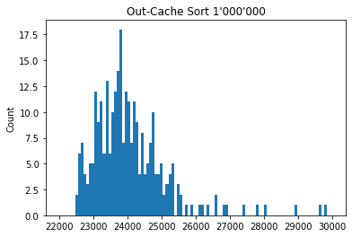

I have written `boost::spreadsort`-like sort, but it works 40% faster for 1'000'000 32-bit ints. The russian post is about how I made it.

# Сделаем spreadsort быстрым снова
## Задача
`boost::spreadsort` -- это гибридный алгоритм in-place сортировки. Он запускает radix/bucket-sort и переходит на `std::sort`, когда массив мал. Я реализовал ту же идею, но быстрей. Расказываю, что успел сделать.

Всегда есть соблазн написать быстрый код, сузив исходную задачу, но мы постараемся сохранить универсальность. Формально, мы пишем сортировку, которая, как и `spreadsort`:
- in-place
- non-stable
- single-thread
- реализует идею radix-sort

Прочитаем код `boost::spreadsort` и заметим еще несколько ограничений. Буст использует старшие биты ключа в качестве номера бакета. Это значит, алгоритм ожидает равномерное распределение ключей на входе. Именно при таком распределении можно повторить результат из описания алгоритма: двухкратное ускорение, по сравнению с `std::sort`. И еще: чтобы ускорение вышло именно за счет поразрядной сортировки, мы не будем использовать никакую сортировку, кроме `std::sort`.
- равномерное распределение ключей
- можно использовать только `std::sort`

`boost::spreadsort` имеет еще одну особенность: код оптимизирован на случай узкого диапазона ключей. Мы можем считать диапазон полным и тогда сразу выиграем 10%, убрав ненужную проверку. Хоть это облегчает задачу, я сохранил эту особенность. Поэтому сравнивать результат мы будем на рандомном ограниченном диапазоне.
- ограниченный диапазон

Всегда можно выиграть, затачиваясь под свое железо. Для честного сравнения я сначала вручную поигрался с параметрами `spreadsort`, а потом запустил оптимизированный монте-карло поиск самых эффективных параметров. Через полтора часа и 20'000 итераций, я нашел несколько хороших наборов, но они почти не отличались от стандартных, поэтому я ничего не менял.

Весь код тестируется на Coffee Lake i7-8750H, с `gcc -O2 -march=native`.

## Первый результат

Я замерил время сортировки 1'000'000 32-битных интов. Слева наша версия, справа -- `boost::spreadsort`. На глазок -- ускорение 30%. В отличие от хитрого буста, наша версия работает в лоб: всегда разбивает на одинаковое количество бакетов. Зато в исходном алгоритме был небольшой недостаток: `spreadsort` искал экстремальные элементы на каждой итерации. Вообще, он находил максимальный и минимальный элементы, разбивал диапазон между ними на равномерные бакеты, заполнял их и рекурсивно запускался на каждом бакете. Алгоритм использовал старшие биты ключа для распределения между бакетами, поэтому диапазон ключей каждого бакета можно определить по старшим битам ключа. Я учел это, поэтому искал экстремальные значения только на первой итерации. Правда, такой трюк не сработает при хитрой partition-функции, которую придется написать, если ключи не равномерно распределены.

Результат неплохой, но это скорее проблемы `boost::spreadsort`, чем наша заслуга. Я не стал выкладывать результаты тестирования на 10'000'000 чисел. На них наша версия работает немного медленней быстрейших 90%, зато не имеет выбросов, которые случаются у буста при широком диапазоне ключей. В этих случаях он замедляется в два раза. Я думаю, это проблема partition-функции и алгоритма, который выбирает количество бакетов.

Я получил ускорение, но можно ли еще быстрей?

Запустим VTune на `boost::spreadsort` и найдем ботлнек.

Видно, что буст упирается в доступ к памяти, которая происходит в случайном (non-consecutive) порядке. Самые тормозящие события: кеш-миссы и TLB-миссы.

Открывает google.scholar.com и ищем "cache-friendly radix sort"

## Cache-friendly radix sort
Это не самая горячая тема Computer Science, но что-то на эту тему есть. В 2010 вышла [статья](https://www.researchgate.net/publication/221213255_Fast_sort_on_CPUs_and_GPUs_a_case_for_bandwidth_oblivious_SIMD_sort) с идеей, как сделать cache-friendly radix sort, хотя и не in-place. В 2014 впервые [описали](http://www.cs.columbia.edu/~orestis/sigmod14I.pdf) in-place алгоритм, который работал с той же идеей. Суть проста: заведем буфер для каждого бакета. Будем переставлять элементы только внутри буферов. Когда какой-нибудь буфер заполняется, сбрасываем его в память и набираем новых элементов. Так мы уменьшим количество TLB-миссов в $L$ раз, где $L$ - количество элементов в одном буфере. Будем использовать буферы длиной в кеш-линию, как предлагают авторы статьи.

Такие результаты обещает статья. Желтая линия -- обычный radix sort, оранжевая -- новый алгоритм. Видно, что новый алгоритм выигрывает, при количестве бакетов > 64. Это объясняется тем, что TLB буфер Xeon E5-4620 как раз вмещает 64 entity на первом уровне. Так как новый алгоритм имеет меньше проблем с tlb-мисами, он обгоняет тривиальную реализацию. Если честно, я не знаю, как объяснить скачок на 8-16 разбиений. По-моему, они оба влезают в L1-кеш. Может, при малом количестве бакетов, удачно работает префетчер?

Так выглядит описание алгоритма. Я потратил много времени, пытаясь реализовать его отсюда. Это ошибка. Половина алгоритма пропущена, половина -- в опечатках. Еще авторы предполагают, что любые последовательные 64 байта -- это кеш-линия. Может, это пропущено для краткости, но в итоге не достает смачных кусков кода с выравниванием и краевыми случаями. Кстати, никакого кода нет.

Я забил на алгоритм и разбирался с идеей. Результат [тут](https://github.com/SteshinSS/fast_radix_sort/blob/master/semen_sort.h#L186). Я не стал делить функцию и оставил подробные комментарии в коде, поэтому не буду останавливаться на пояснениях. Скажу только, что это непростой код.

Когда мы сбрасываем буфер в память, она записывается в кеш. Нам это не надо, потому что обращаться к сброшенному мы не планируем. Такую память называют non-temporal и для работы с ней существуют подходящие интринзики. Мне это очень интересно, но я не успел полностью разобрать главу из Intel Optimization Manual. Я нашел `_mm256_stream_si256`, которая записывает 32 байта сквозь кеш, но программа стала работать медленней. Я нашел `_mm512_stream_si512` размером в кеш-линию, но у меня Coffee Lake i7 без AVX512. Думаю, здесь можно разобраться и сделать быстрее. `memmove`, кстати, так же быстр, как поэлементное копирование.

Из интересного, я раскидал в главном цикле `__builtin_expect`, но они ничего не поменяли.

## Новые результаты

Я отсортировал 10'000'000 32-битных интов. С помощью известного статистического теста "eye-ball statistics", мы видим, что опередили буст. 

До этого мы сравнили тривиальный In-Cache с `boost::spreadsort`. Сравним между собой In-Cache и новый Out-Cache алгоритмы

Мы ускорились. Более того, Out-Cache алгоритм работает на 40% быстрей буста для 1'000'000 чисел. Я проверил, результат похож на статью. Out-Of-Cache перегоняет In-Cache при 2^7 бакетов.

На картинке время одного разбиения на бакеты. В столбцах записаны двоичные логарифмы от количества бакетов.

## Дальнейшие действия
Ускорять алгоритм можно очень долго. Это все, что я успел. Посмотрим, что можно делать дальше.

### Выбор стратегии
Самое важное, что я рассчитывал сделать, это выбор стратегии. Наша задача -- получить маленький бакет, на котором можно запустить `std::sort`. Это можно сделать разными способами. Нужно ли сразу применять Out-Of-Cache или лучше пару раз применить In-Cache? Это решается динамикой. Как в той задаче про мячик и лесенку, только вместо ступенек - размер бакета, а вместо цены -- время работы, которой измеряется экспериментально.

То что я тестировал выше -- хаки. Сначала запускается OutCache на 2^11 бакетов (потому что 2^12 у меня не влезает в L2 кеш), а внутри InCache на 2^10 бакетов. Правильный порядок определяется размером входного массива и, вроде, размером элемента.

### Правильная работа с памятью
Я не понял, как работать с кешем. Где-то есть команды, которые помогут эффективно управлять памятью.

### Partition-функция
Сейчас мы рассчитываем, что ключи равномерно распределены. А если нет? В тоже статье 2014 года отдельный параграф посвящен тому, как быстро выбрать номер бакета с помощью SIMD-инструкций.

### Финальная сортировка
Можно заменить `std::sort` на что-нибудь побыстрей. В статье использовался merge sort.

### Тестирование
Я написал сортировки как шаблон со всякими sizeof. Я ожидаю, что код заработает для разных ключей, но сам тестировал только 32-бита. На всякий случай приложил стресс-тест.

#### Заключение
Это все. Через несколько часов у меня экзамен по сложностям алгоритмов. Пойду поготовлюсь...
